# Цель работы

Освоить процедуры компиляции и сборки программ, написанных на ассемблере NASM.

# Выполнение лабораторной работы

В @tbl-commands приведены основные команды, используемые при работе с git и компиляцией программ.

: Основные команды, используемые при работе {#tbl-commands}

| Команда | Описание |
|---------|----------|
| `cd` | Переход в указанный каталог |
| `git pull` | Обновление локального репозитория |
| `touch` | Создание файла |
| `nasm` | Компилятор ассемблера NASM |
| `git add` | Добавление изменений в индекс |
| `git commit` | Создание коммита |
| `git push` | Отправка изменений на удаленный репозиторий |
| `ld` | Связывает объектные файлы в исполняемую программу |

Рассмотрим пример простой программы на языке ассемблера NASM. Традиционно первая программа выводит приветственное сообщение "Hello world!" на экран. Создадим каталог для работы с программами на языке ассемблера NASM и перейдем в созданный каталог [рис. @fig-001].

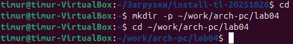{#fig-001 width=90%}

Создадим текстовый файл с именем `hello.asm` и откроем его с помощью текстового редактора, например `gedit` [рис. @fig-002].

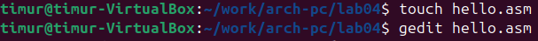{#fig-002 width=90%}

Вводим в него следующий текст [рис. @fig-003].

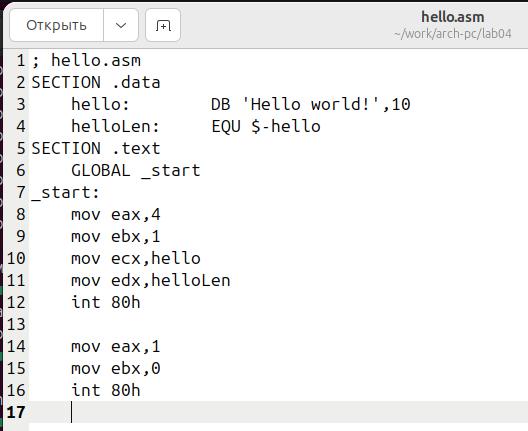{#fig-003 width=90%}

NASM превращает текст программы в объектный код. Компилируем наш текст и проверим, что появился новый файл с названием `hello.o` [рис. @fig-004].

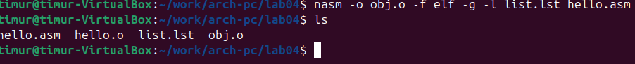{#fig-004 width=90%}

Чтобы получить исполняемую программу, передадим объектный файл на обработку компоновщику и проверим, что исполняемый файл `hello` был создан [рис. @fig-005].

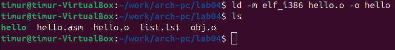{#fig-005 width=90%}

Ключ `-o` с последующим значением задает в данном случае имя создаваемого исполняемого файла [рис. @fig-006].

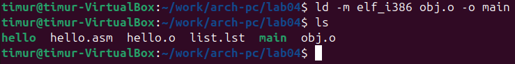{#fig-006 width=90%}

Запустим на выполнение созданный исполняемый файл, находящийся в текущем каталоге [рис. @fig-007].

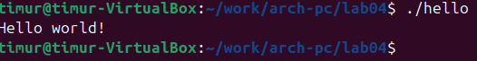{#fig-007 width=90%}

# Задание для самостоятельной работы

1. В каталоге `~/work/arch-pc/lab04` с помощью команды `cp` создайте копию файла `hello.asm` с именем `lab4.asm` [рис. @fig-008].

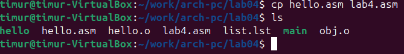{#fig-008 width=90%}

2. С помощью любого текстового редактора внесите изменения в текст программы в файле `lab4.asm` так, чтобы вместо "Hello world!" на экран выводилась строка с вашим именем [рис. @fig-009].

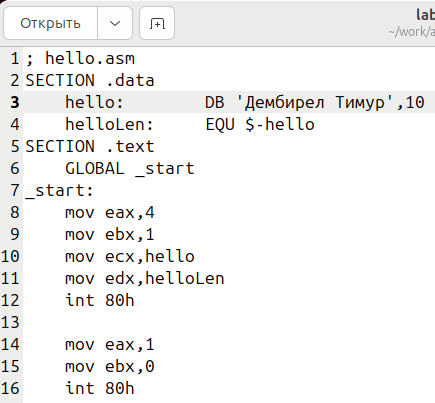{#fig-009 width=90%}

3. Оттранслируйте полученный текст программы `lab4.asm` в объектный файл. Выполните компоновку объектного файла и запустите получившийся исполняемый файл [рис. @fig-010].

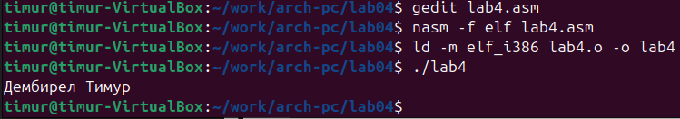{#fig-010 width=90%}

4. Скопируйте файлы `hello.asm` и `lab4.asm` в Ваш локальный репозиторий в каталог `~/work/study/2025-2026/Архитектура компьютера/arch-pc/labs/lab04/`. Загрузите файлы на Github [рис. @fig-011].

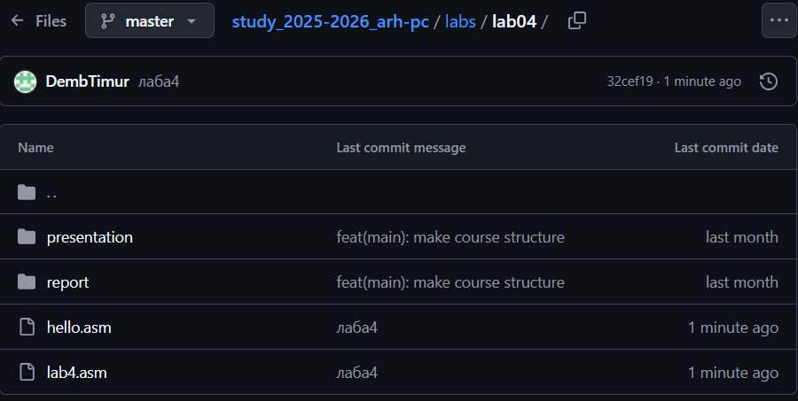{#fig-011 width=90%}

# Вывод

В данной лабораторной работе я освоил процедуры компиляции и сборки программ, написанных на ассемблере NASM.
