# Цель работы

Приобретение практических навыков работы в Midnight Commander. Освоение инструкций языка ассемблера `mov` и `int`.

# Выполнение лабораторной работы

В @tbl-commands приведены основные команды, используемые при работе с git, элементами программирования и компиляцией программ.

: Основные команды, используемые при работе {#tbl-commands}

| Команды | Описание |
|---------|----------|
| `mov` | Дублирует данные источника в приемнике |
| `int` | Вызов прерывания с указанным номером |
| `touch` | Создание файла |
| `nasm` | Компилятор ассемблера NASM |
| `git add` | Добавление изменений в индекс |
| `git commit` | Создание коммита |
| `git push` | Отправка изменений на удаленный репозиторий |
| `ld` | Связывает объектные файлы в исполняемую программу |

Откроем Midnight Commander и перейдем в каталог созданный при выполнении лабораторной работы №4. С помощью функциональной клавиши `F7` создаем папку `lab05`, переходим в него и создаем при помощи `touch` файл `lab5-1.asm` [рис. @fig-001].

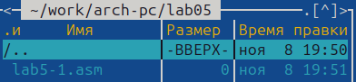{#fig-001 width=90%}

С помощью функциональной клавиши `F4` откроем файл `lab5-1.asm` для редактирования во встроенном редакторе. Введем текст программы из листинга 5.1, далее сохраняем и закрываем файл [рис. @fig-002].

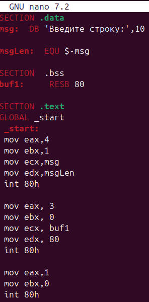{#fig-002 width=90%}

С помощью функциональной клавиши `F3` откроем файл `lab5-1.asm` для просмотра и убедимся, что файл содержит текст программы [рис. @fig-003].

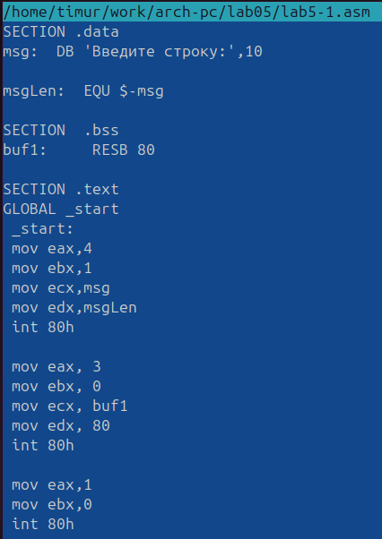{#fig-003 width=90%}

Оттранслируем текст программы `lab5-1.asm` в объектный файл. Выполним компоновку объектного файла и запустим получившийся исполняемый файл. Программа выводит строку 'Введите строку:' и ожидает ввода с клавиатуры. На запрос вводим наше ФИО. [рис. @fig-004].

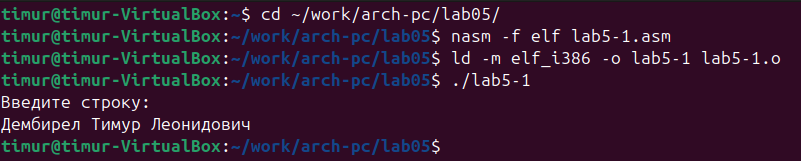{#fig-004 width=90%}

Скачиваем файл `in_out.asm` со страницы курса в ТУИС. Подключаемый файл `in_out.asm` должен лежать в том же каталоге, что и файл с программой, в которой он используется. [рис. @fig-005].

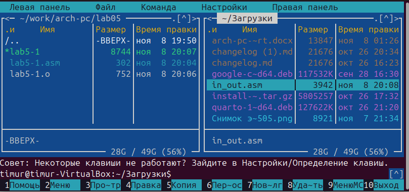{#fig-005 width=90%}

С помощью функциональной клавиши `F6` создаем копию файла `lab5-1.asm` с именем `lab5-2.asm`. Выделяем файл `lab5-1.asm`, нажимаем клавишу `F6`, вводим имя файла `lab5-2.asm` и нажимаем клавишу `Enter` [рис. @fig-006].

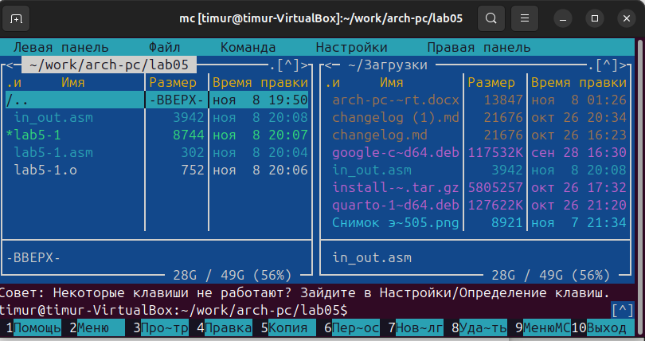{#fig-006 width=90%}

Исправляем текст программы в файле `lab5-2.asm` с использованием подпрограмм из внешнего файла `in_out.asm` в соответствии с листингом 5.2 [рис. @fig-007].

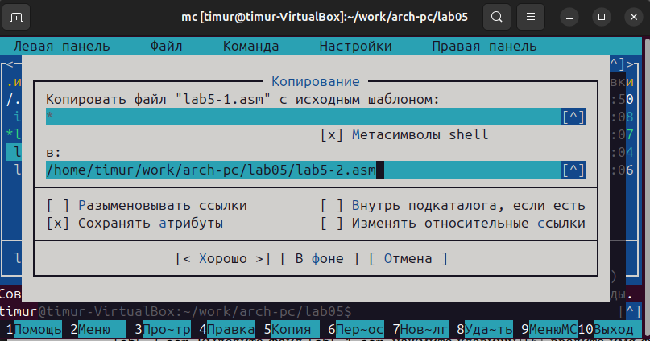{#fig-007 width=90%}

Создаем исполняемый файл и проверяем его работу [рис. @fig-008].

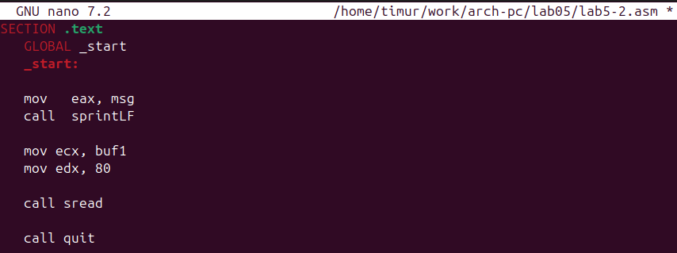{#fig-008 width=90%}

В файле `lab5-2.asm` заменяем подпрограмму `sprintLF` на `sprint`. Создаем исполняемый файл и проверяем его работу. Также смотрим есть ли разница [рис. @fig-009].

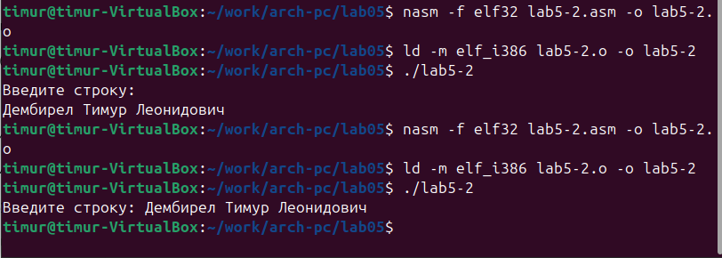{#fig-009 width=90%}

Разница в том, что при `sprint` все выводится в одну строку, а при `sprintLF` в разные.

# Задание для самостоятельной работы

1. Создайте копию файла `lab5-1.asm`. Внесите изменения в программу (без использования внешнего файла `in_out.asm`), так чтобы она работала по следующему алгоритму:
   • вывести приглашение типа "Введите строку:";
   • ввести строку с клавиатуры;
   • вывести введённую строку на экран. [рис. @fig-010].

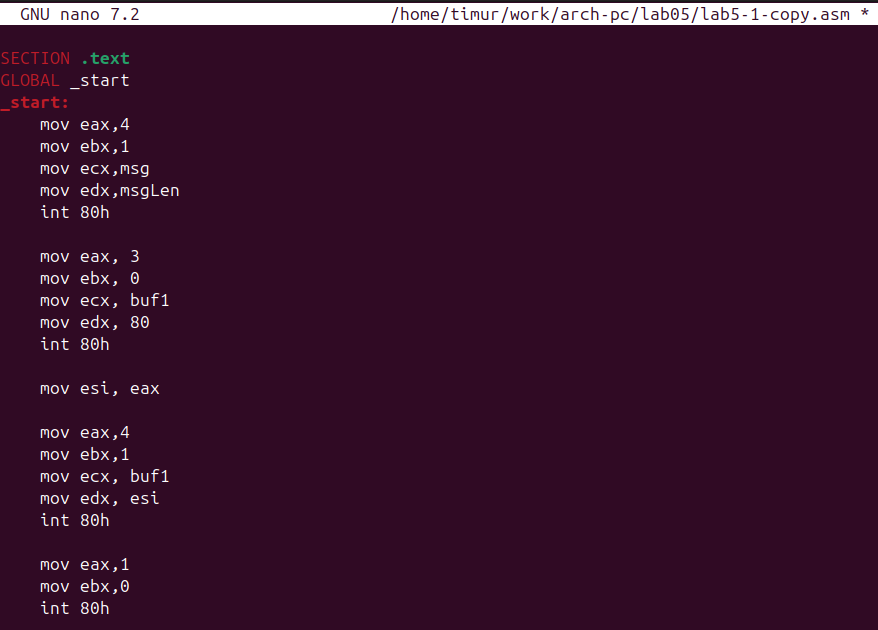{#fig-010 width=90%}

2. Получите исполняемый файл и проверьте его работу. На приглашение ввести строку введите свою фамилию. [рис. @fig-011].

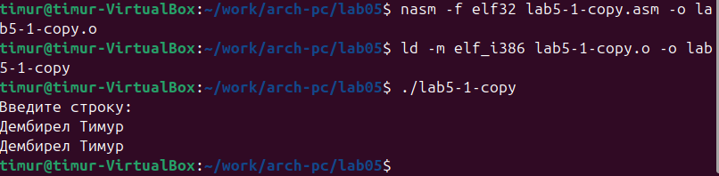{#fig-011 width=90%}

3. Создайте копию файла `lab5-2.asm`. Исправьте текст программы с использование подпрограмм из внешнего файла `in_out.asm`, так чтобы она работала по следующему алгоритму:
   • вывести приглашение типа "Введите строку:";
   • ввести строку с клавиатуры;
   • вывести введённую строку на экран [рис. @fig-012].

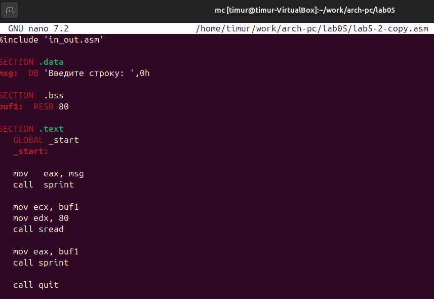{#fig-012 width=90%}

4. Создайте исполняемый файл и проверьте его работу. [рис. @fig-013].

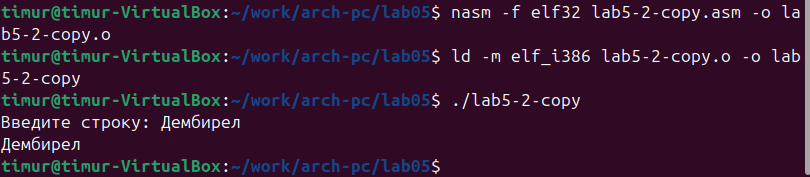{#fig-013 width=90%}

# Вывод

В этой лабораторной работе я приобрел практические навыки работы в Midnight Commander и освоил инструкции языка ассемблера `mov` и `int`.
