# Цель работы

Освоение арифметических инструкций языка ассемблера NASM.

# Выполнение лабораторной работы

В @tbl-commands приведены основные команды, используемые при работе с git, элементами программирования и компиляцией программ.

: Основные команды, используемые при работе {#tbl-commands}

| Команды | Описание |
|---------|----------|
| `mov` | Дублирует данные источника в приемнике |
| `add` | Целочисленное сложение |
| `touch` | Создание файла |
| `nasm` | Компилятор ассемблера NASM |
| `git add` | Добавление изменений в индекс |
| `git commit` | Создание коммита |
| `git push` | Отправка изменений на удаленный репозиторий |
| `ld` | Связывает объектные файлы в исполняемую программу |
| `xor` | Выполняет операцию исключающего ИЛИ |
| `div` | Беззнаковое деление |
| `mul` | Умножение |
| `call` | Вызов программы |

Создадим каталог для программам лабораторной работы № 6, перейдем в него и создадим файл  'lab6-1.asm' [рис. @fig-001].

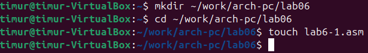{#fig-001 width=90%}

Рассмотрим примеры программ вывода символьных и численных значений. Программы будут выводить значения записанные в регистр 'eax'. Введем в файл 'lab6-1.asm' текст программы из листинга 6.1 [рис. @fig-002].

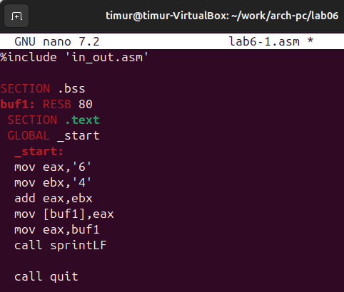{#fig-002 width=90%}

Создадим исполняемый файл и запустим его. В результате должно вывести символ 'j', вместо числа 10 [рис. @fig-003].

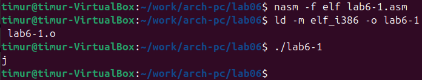{#fig-003 width=90%}

Далее изменим текст программы и вместо символов, запишем в регистры числа. Исправим текст программы, создадим исполняемый файл и запустим его. В результате должен вывестись символ с кодом 10, но отображаться он не будет [рис. @fig-004].

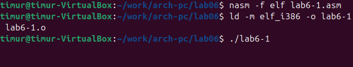{#fig-004 width=90%}

Создадим файл 'lab6-2.asm' в каталоге '~/work/arch-pc/lab06' и введем в него текст программы из листинга 6.2 [рис. @fig-005].

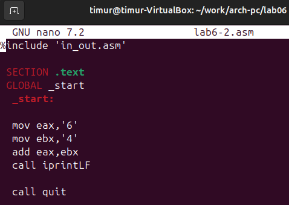{#fig-005 width=90%}

Создайте исполняемый файл и запустите его. В результате работы программы мы получим число 106. Благодаря функции 'iprintLF' мы  выводим число, а не символ, кодом которого является это число [рис. @fig-006].

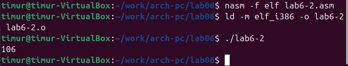{#fig-006 width=90%}

Аналогично предыдущему примеру изменим символы на числа [рис. @fig-007].

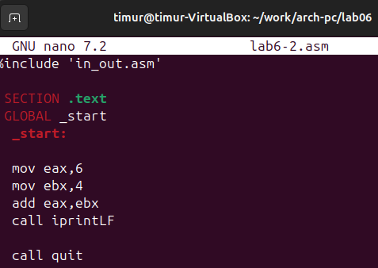{#fig-007 width=90%}

Создадим исполняемый файл и запустим его [рис. @fig-008].

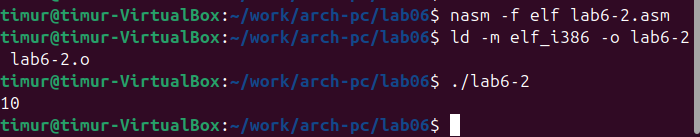{#fig-008 width=90%}

Также нас попросили заменить 'iprintLF' на 'iprint', создать исполняемый файл, запустить и найти отличия в выводе функций [рис. @fig-009].

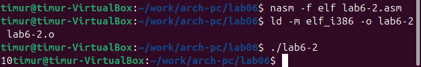{#fig-009 width=90%}

Отличия в том, что при 'ipringLF' вывод происходит на след строке, а при 'iprint' в начале командной строки.  

Чтобы выполнить пример арифметических операций в 'NASM' приведем программу вычисления арифметического выражения f(x)=(5∗2+3)/3. Создаем файл 'lab6-3.asm' в каталоге '~/work/arch-pc/lab06' и вводим текст программы из листинга 6.3 [рис. @fig-010]

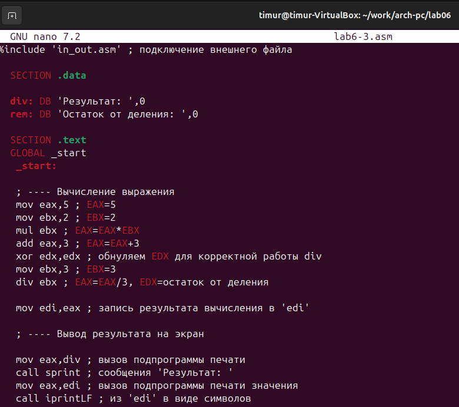{#fig-010 width=90%}

Создадим исполняемый файл и проверим, что в ответе получится 4 и 1 [рис. @fig-011].

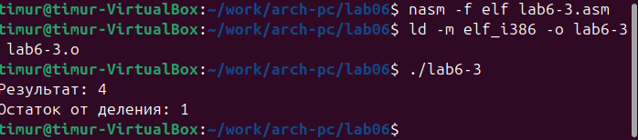{#fig-011 width=90%}

Далее изменим текст программы для вычисления выражения f(x)=(4∗6+2)/5 [рис. @fig-012].

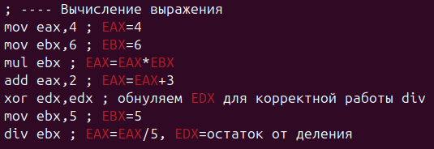{#fig-012 width=90%}

Создадим исполняемый файл и проверим его работу [рис. @fig-013].

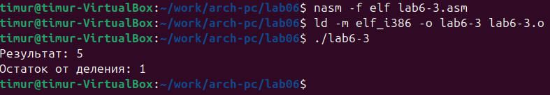{#fig-013 width=90%}

В качестве другого примера рассмотрим программу вычисления варианта задания по номеру студенческого билета. Создадим файл 'variant.asm' в каталоге '~/work/arch-pc/lab06' и введем туда текст программы из листинга 6.4 [рис. @fig-014].

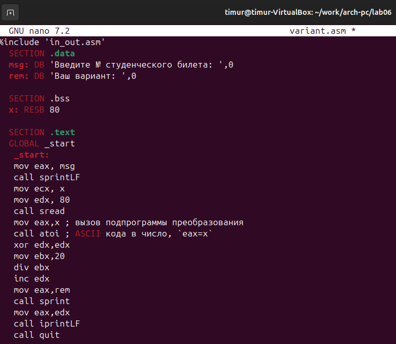{#fig-014 width=90%}

Создаем исполняемый файл и проверяем его [рис. @fig-015].

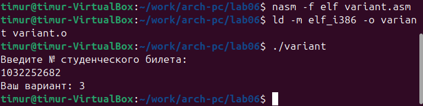{#fig-015 width=90%}

# Ответы на вопросы

1. Какие строки листинга 6.4 отвечают за вывод на экран сообщения ‘Ваш вариант:’?

Ответ: 'mov eax,rem', 'call sprint'

2. Для чего используется следующие инструкции?
'mov ecx, x'
'mov edx, 80'
'call sread'

Ответ: Эти инструкции используются для ввода данных от пользователя

3. Для чего используется инструкция “call atoi”

Ответ: Инструкция 'call atoi' вызывает подпрограмму преобразования ASCII-строки в число. Она преобразует введенную строку (номер студенческого билета) в целое число, которое сохраняется в регистре eax

4. Какие строки листинга 6.4 отвечают за вычисления варианта?

Ответ: 
'xor edx,edx'
'mov ebx,20'
'div ebx'
'inc edx'

5. В какой регистр записывается остаток от деления при выполнении инструкции “div ebx”?

Ответ: Остаток от деления записывается в регистр 'edx'

6. Для чего используется инструкция “inc edx”?

Ответ: Инструкция 'inc edx' увеличивает значение в регистре 'edx' на 1. Поскольку остаток от деления на 20 может быть от 0 до 19, а варианты обычно нумеруются с 1 до 20, эта инструкция преобразует остаток в диапазон 1-20

7. Какие строки листинга 6.4 отвечают за вывод на экран результата вычислений?

Ответ:
'mov eax,edx'
'call iprintLF'

# Задание для самостоятельной работы

1. Написать программу вычисления выражения y=f(x). Программа должна выводить выражение для вычисления, выводить запрос на ввод значения x, вычислять заданное выражение в зависимости от введенного x, выводить результат вычислений. Вид функции f(x) выбрать из таблицы 6.3 вариантов заданий в соответствии с номером
полученным при выполнении лабораторной работы. Создайте исполняемый файл и проверьте его работу для значений x1 и x2 из 6.3 [рис. @fig-016].

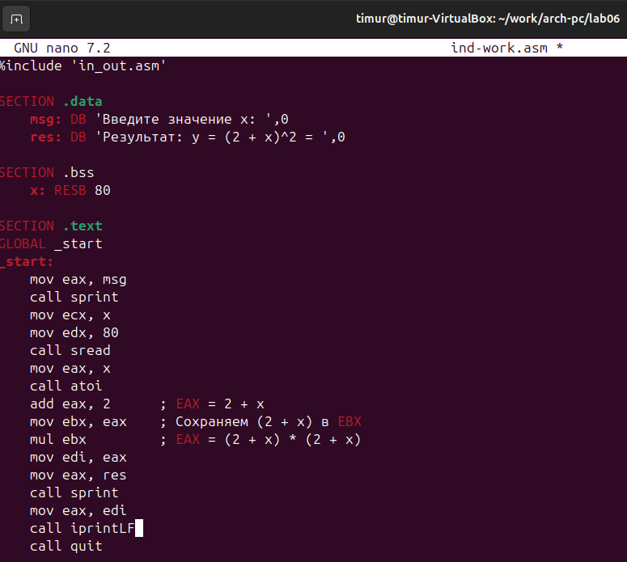{#fig-016 width=90%}

Создаем исполняемый файл и проверяем [рис. @fig-017].

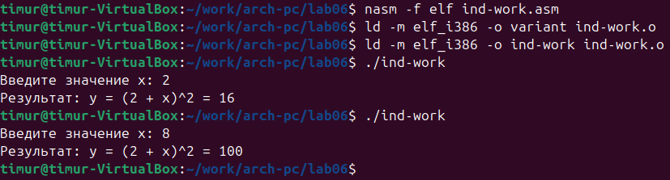{#fig-017 width=90%}

# Вывод

В ходе данной лабораторной работы я освоил арифметические инструкции языка ассемблера 'NASM'.

