# Цель работы

Изучение команд условного и безусловного переходов. Приобретение навыков написания программ с использованием переходов. Знакомство с назначением и структурой файла листинга.

# Выполнение лабораторной работы

В @tbl-commands приведены основные команды, используемые при работе с git, элементами программирования и компиляцией программ.

: Основные команды, используемые при работе {#tbl-commands}

| Команды | Описание |
|---------|----------|
| `touch` | Создание файла |
| `nasm` | Компилятор ассемблера NASM |
| `git add` | Добавление изменений в индекс |
| `git commit` | Создание коммита |
| `git push` | Отправка изменений на удаленный репозиторий |
| `ld` | Связывает объектные файлы в исполняемую программу |
| `mkdir` | Создает новую директорию |
| `mcedit` | Текстовый редактор в терминале |

Создадим каталог для программ лабораторной работы № 7, перейдем в него и создадим файл 'lab7-1.asm' [рис. @fig-001].

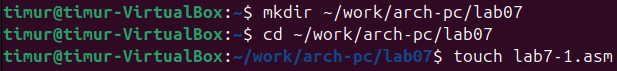{#fig-001 width=90%}

Рассмотрим пример программы с использованием инструкции 'jmp'. Введем в файл 'lab7-1.asm' текст программы из листинга 7.1 [рис. @fig-002].

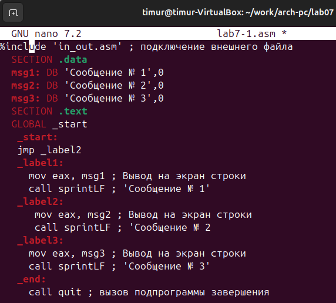{#fig-002 width=90%}

Создаем исполняемый файл и запускаем его [рис. @fig-003].

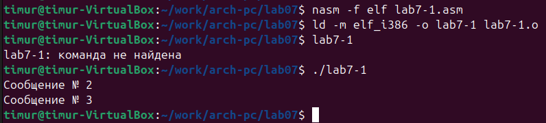{#fig-003 width=90%}

Изменим текст программы, чтобы он выводил сначала 'сообщение №2', а затем 'сообщение №1', в соответствии с листингом 7.2 [рис. @fig-004].

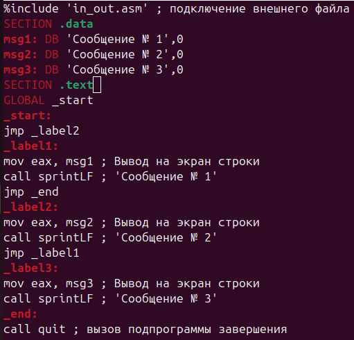{#fig-004 width=90%}

Создаем исполняемый файл и проверяем его работу [рис. @fig-005].

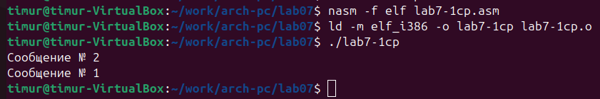{#fig-005 width=90%}

Изменим текст программы добавив или изменив инструкции 'jmp', чтобы он выводил сообщения с 3 по 1 номер [рис. @fig-006].

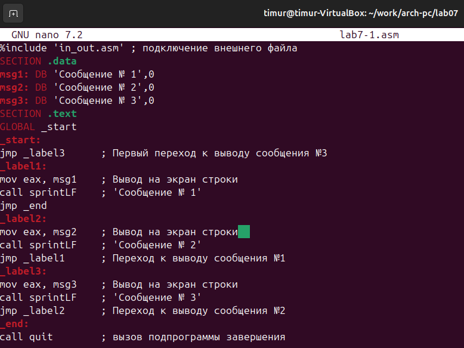{#fig-006 width=90%}

Создаем исполняемый файл и проверяем его [рис. @fig-007]

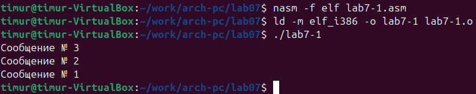{#fig-007 width=90%}

Создаем файл 'lab7-2.asm' в каталоге '~/work/arch-pc/lab07'. Внимательно изучаем текст
программы из листинга 7.3 и введите в 'lab7-2.asm' [рис. @fig-008].

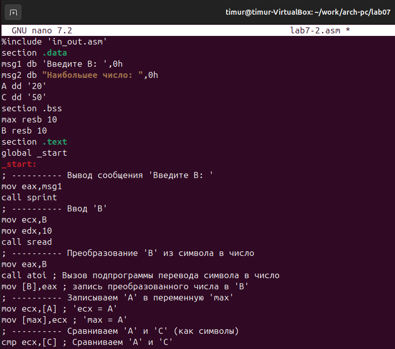{#fig-008 width=90%}

Далее создаем исполняемый файл и проверяем его [рис. @fig-009].

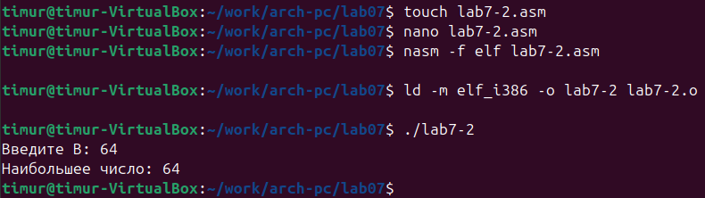{#fig-009}

Создаем файл листинга для программы 'lab7-2.asm', откроем его с помощью 'mcedit'. Внимательно ознакомимся с его форматом и содержимым. Подробно объясним три строки листинга по выбору:
1)Строка 1 '%include 'in_out.asm''. Подключает внешний файл 'in_out.asm', который содержит определения функций ввода-вывода (таких как 'sprint', 'slen', 'quit' и др.) [рис. @fig-010].

{#fig-010 width=90%}

2)Строка 8 '8 00000003 803800 <1> cmp byte [eax], 0'. Сравнивает байт по адресу в регистре EAX с нулём [рис. @fig-011].

{#fig-011 width=90%}

3)Строка 14 '0000000B 29D8 <1> sub eax, ebx'. Вычитает значение регистра EBX из EAX (eax = eax - ebx) [рис. @fig-012].

{#fig-012 width=90%}

Откроем файл с программой 'lab7-2.asm' и в любой инструкции с двумя операндами удаляем один операнд  [рис. @fig-013].

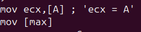{#fig-013 width=90%}

Выполняем трансляцию с получением файла листинга [рис. @fig-014].

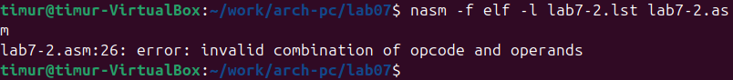{#fig-014 width=90%}

Вышла ошибка 'invalid combination of opcode and operands', такая же ошибка появляется и в листинге [рис. @fig-015].

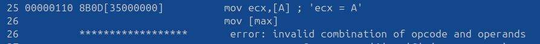{#fig-015 width=90%}

В результате этих изменений создается только листинг 'lab7-2.lst', а файл трансляции 'lab7-2.o' не создается и прерывается с ошибкой.

#Задание для самостоятельной работы

1. Напишите программу нахождения наименьшей из 3 целочисленных переменных a,b и . Значения переменных выбрать из табл. 7.5 в соответствии с вариантом, полученным при выполнении лабораторной работы № 7. Создайте исполняемый файл и проверьте его работу [рис. @fig-016] [рис. @fig-017].

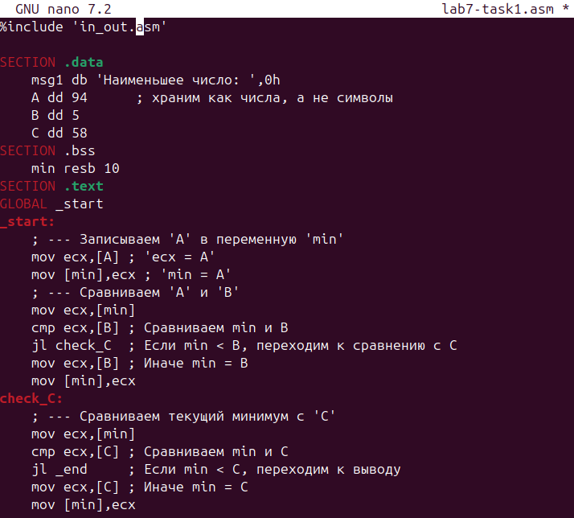{#fig-016 width=90%}

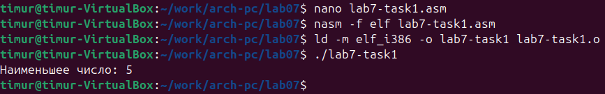{#fig-017 width=90%}

2. Напишите программу, которая для введенных с клавиатуры значений x и a вычисляет значение заданной функции f(x) и выводит результат вычислений. Вид функции f(x) выбрать из таблицы 7.6 вариантов заданий в соответствии с вариантом, полученным при выполнении лабораторной работы № 7. Создайте исполняемый файл и проверьте его работу для значений x и a из 7.6 [рис. @fig-018] [рис. @fig-019].

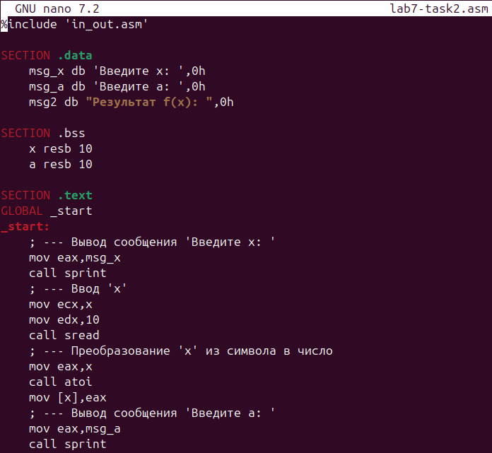{#fig-018 width=90%}

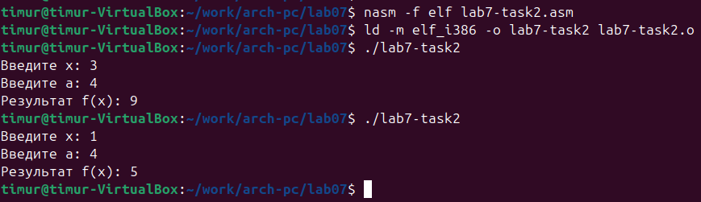{#fig-019 width=90%}

# Вывод

В ходе данной лабораторной работы я изучил команды условного и безусловного переходов, приобрел навыки написания программ с использованием переходов и познакомился с назначением и структурой файла листинга.
