# Цель работы

Изучение команд условного и безусловного переходов. Приобретение навыков написания программ с использованием переходов. Знакомство с назначением и структурой файла листинга.

# Выполнение лабораторной работы

В @tbl-commands приведены основные команды, используемые при работе с git, элементами программирования и компиляцией программ.

: Основные команды, используемые при работе {#tbl-commands}

| Команды | Описание |
|---------|----------|
| `touch` | Создание файла |
| `nasm` | Компилятор ассемблера NASM |
| `git add` | Добавление изменений в индекс |
| `git commit` | Создание коммита |
| `git push` | Отправка изменений на удаленный репозиторий |
| `ld` | Связывает объектные файлы в исполняемую программу |
| `mkdir` | Создает новую директорию |
| `push` | Размещает значение в стеке |
| `pop` | Извлекает значение из стека |
| `loop` | Уменьшает регистр ECX на 1, переходит на метку, если ECX ≠ 0 |

Создаем каталог для программ лабораторной работы № 8, перейдем в него и создаем
файл lab8-1.asm [рис. @fig-001].

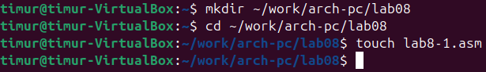{#fig-001 width=90%}

Вводим в файл lab8-1.asm текст программы из листинга 8.1 [рис. @fig-002].

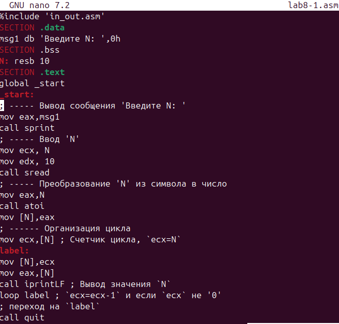{#fig-002 width=90%}

Создаем исполняемый файл и проверяем его [рис. @fig-003].

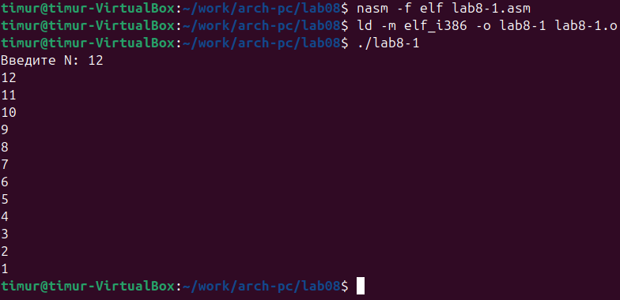{#fig-003 width=90%}

Изменим текст программы добавив изменение значение регистра ecx в цикле [рис. @fig-004].

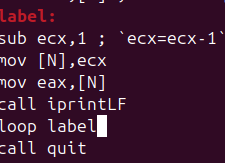{#fig-004 width=90%}

И также создаем исполняемый файл и проверяем его работу [рис. @fig-005].

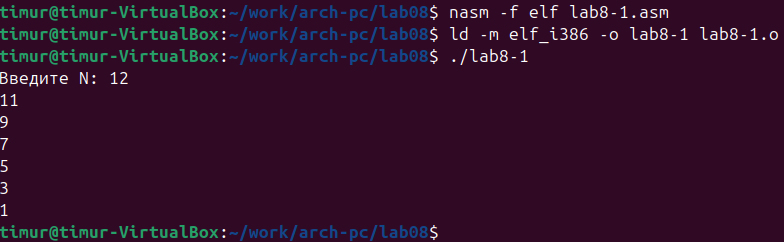{#fig-005 width=90%}

Регистр каждый раз уменьшается на 2, а  число проходов не соответствует.

Для использования регистра ecx в цикле и сохранения корректности работы программы используем стек. Внесем изменения в текст программы добавив команды push и pop для сохранения значения счетчика цикла loop [рис. @fig-006].

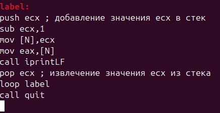{#fig-006 width=90%}

Создаем исполняемый файл и проверяем [рис. @fig-007].

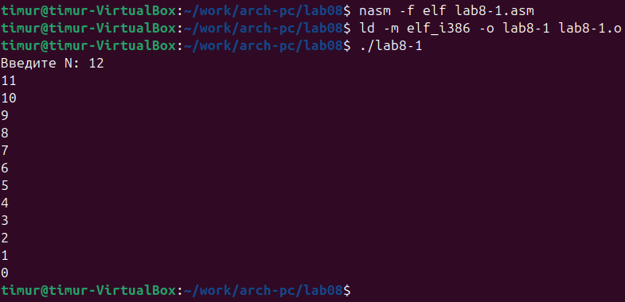{#fig-007 width=90%}

Число проходов цикла соответствует значению N.

Создаем файл lab8-2.asm в каталоге ~/work/arch-pc/lab08 и вводим в него текст программы из листинга 8.2 [рис. @fig-008].

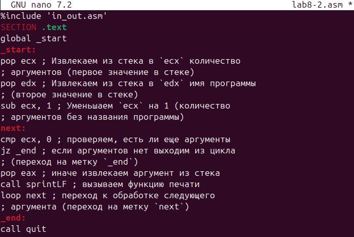{#fig-008 width=90%}

Создаем исполняемый файл и запускаем его, указав аргументы [рис. @fig-009].

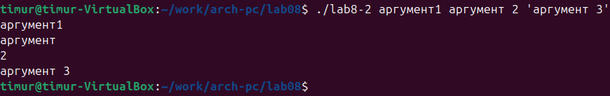{#fig-009 width=90%}

Программа обработала все аргументы.

Создим файл lab8-3.asm в каталоге ~/work/archpc/lab08 и введем в него текст программы из листинга 8.3 [рис. @fig-010].

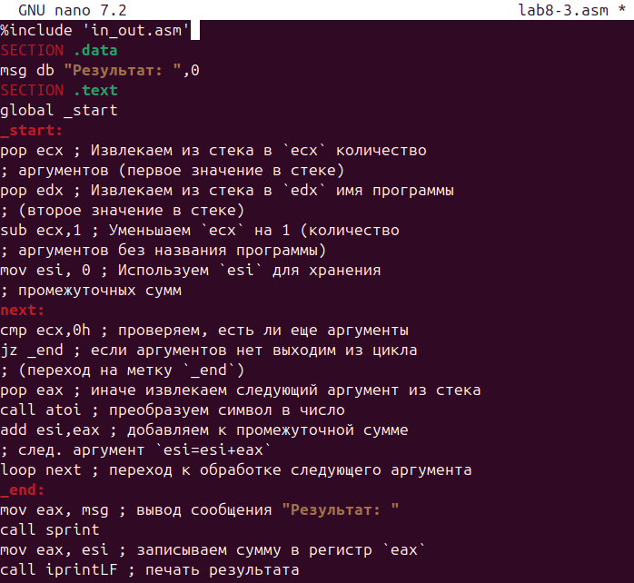{#fig-010 width=90%}

Создаем исполняемый файл и запускаем его, указав аргументы [рис. @fig-011].

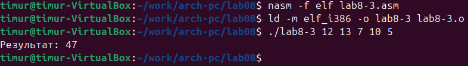{#fig-011 width=90%}

Изменим текст программы из листинга 8.3 для вычисления произведения аргументов командной строки [рис. @fig-012].

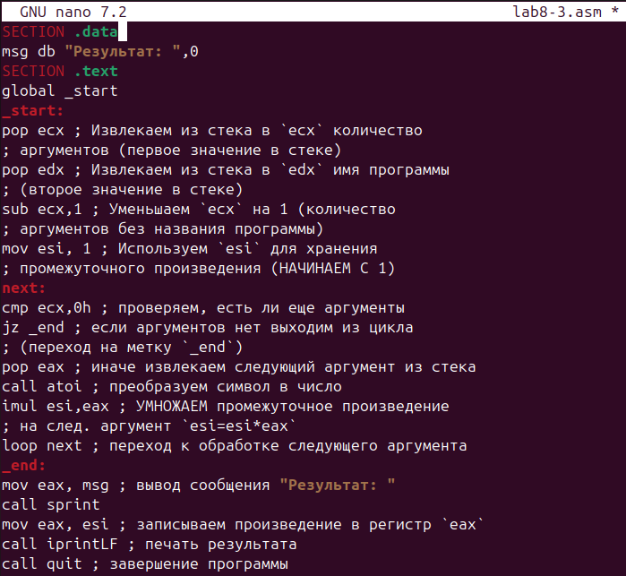{#fig-012 width=90%}

Создаем исполняемый файл и проверяем [рис. @fig-013].

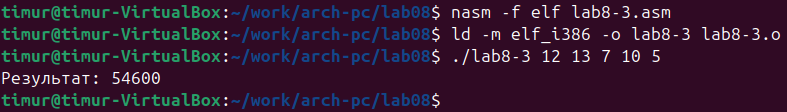{#fig-013 width=90%}

#Задание для самостоятельной работы

1. Напишите программу, которая находит сумму значений функции f(x) для x = x1, x2, ..., xn, т.е. программа должна выводить значение f(x) + f(x2) + ... + f(xn).Значения xi передаются как аргументы. Вид функции f(x) выбрать из таблицы
8.1 вариантов заданий в соответствии с вариантом, полученным при выполнении лабораторной работы № 7. Создайте исполняемый файл и проверьте его работу на нескольких наборах x = x1, x2, ..., xn. Пример работы программы для функции f(x) = x + 2 и набора x1 = 1, x2 = 2, x3 = 3, x4 = 4:
user@dk4n31:~$ ./main 1 2 3 4
Функция: f(x)=x+2
Результат: 18
user@dk4n31:~$ [рис. @fig-014] [рис. @fig-015]

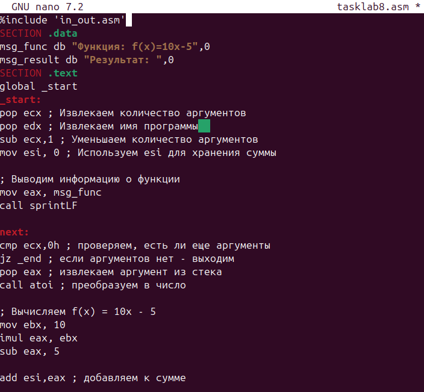{#fig-014 width=90%}

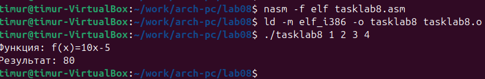{#fig-015 width=90%}

# Вывод

В ходе данной лабораторной работы я изучил команды условных и безусловных переходов. Приобрел навыки написания программ с использованием переходов. Познакомился с назначением и структурой файлов листинга.
