# Цель работы

Приобретение навыков написания программ с использованием подпрограмм. Знакомство с методами отладки при помощи GDB и его основными возможностями.

# Выполнение лабораторной работы

В @tbl-commands приведены основные команды, используемые при работе с git, элементами программирования.

: Основные команды, используемые при работе {#tbl-commands}

| Команды | Описание |
|---------|----------|
| `touch` | Создание файла |
| `nasm` | Компилятор ассемблера NASM |
| `git add` | Добавление изменений в индекс |
| `git commit` | Создание коммита |
| `git push` | Отправка изменений на удаленный репозиторий |
| `ld` | Связывает объектные файлы в исполняемую программу |
| `mkdir` | Создает новую директорию |
| `GDB` | Производит отладку многих языков программирования |
| `quit` | Команда для выхода из отладчика |
| `disassemble` | Команда для просмотра дизассемблированного кода программы |
| 'break' | Команда для создания точки останова |
| 'info breakpoints' | Команда для вывода информации о всех установленных точках останова |
| 'stepi(si)' | Позволяет выполнять программу по шагам |
| 'info registers' | Команда для просмотра содержимого регистров |

Создаем каталог для выполнения лабораторной работы № 9, переходим в него и создаем файл lab09-1.asm [рис. @fig-001].

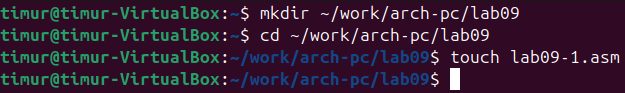{#fig-001 width=90%}

Введем в файл lab09-1.asm текст программы из листинга 9.1 с помощью любого текстового редактора [рис. @fig-002]

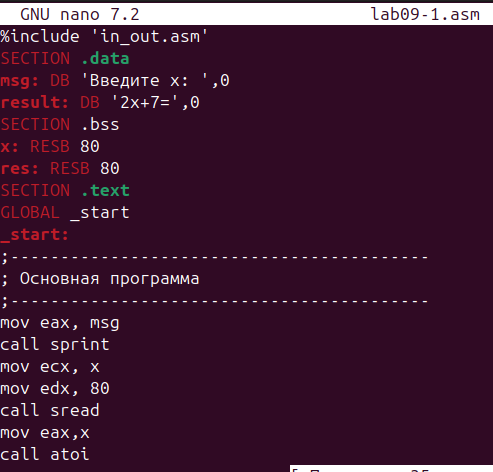{#fig-002 width=90%}

Создаем исполняемый файл и проверяем его [рис. @fig-003].

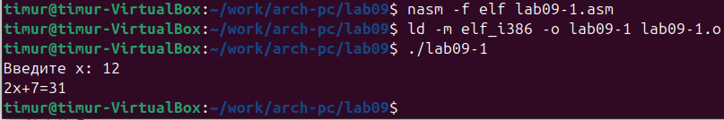{#fig-003 width=90%}

Изменяем текст программы, добавив подпрограмму _subcalcul в подпрограмму _calcul [рис. @fig-004].

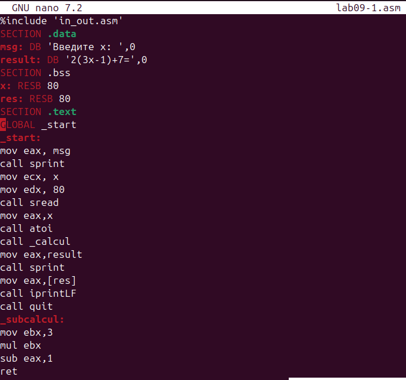{#fig-004 width=90%}

И также создаем исполняемый файл и проверяем его работу [рис. @fig-005].

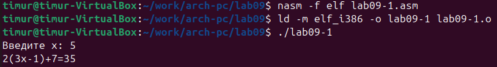{#fig-005 width=90%}

Создаем файл lab09-2.asm с текстом программы из Листинга 9.2 [рис. @fig-006].

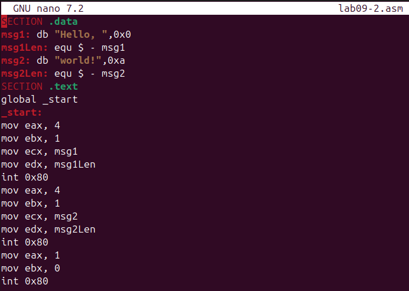{#fig-006 width=90%}

Получаем исходный файл с помощью отладчика GDB и запускаем команду [рис. @fig-007].

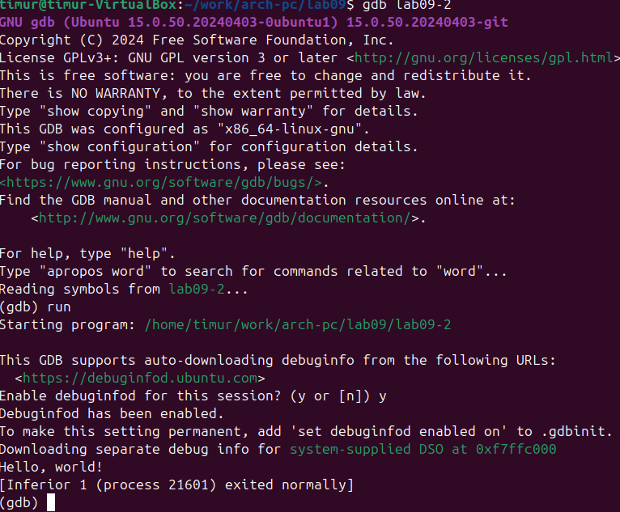{#fig-007 width=90%}

Устанавливаем брейкпоинт на метку _start, с которой начинается выполнение любой ассемблерной программы, и запускаем её [рис. @fig-008].

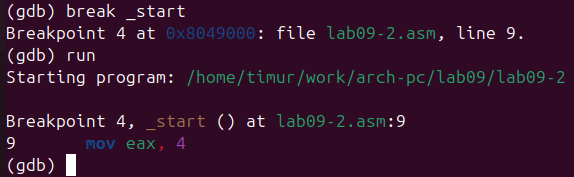{#fig-008 width=90%}

Смотрим дисассимилированный код программы с помощью команды disassemble начиная с метки _start [рис. @fig-009].

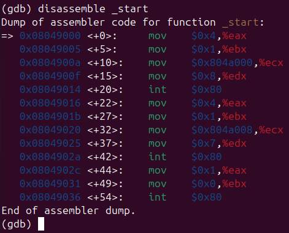{#fig-009 width=90%}

Переключимся на отображение команд с Intel’овским синтаксисом, введя команду set
disassembly-flavor intel [рис. @fig-010].

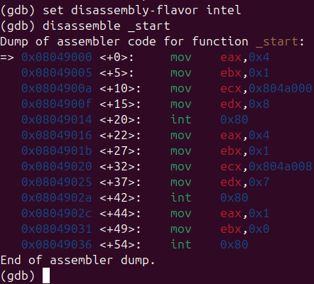{#fig-010 width=90%}

Различия отображения синтаксиса машинных команд в режимах ATT и Intel:

1. Последовательность операндов: В синтаксисе ATT операнды идут в обратном порядке — сначала указывается исходный операнд, затем принимающий. В синтаксисе Intel, как правило, сохраняется прямой порядок: принимающий операнд записывается первым, исходный — вторым.

2. Разделительные знаки: В синтаксисе ATT для разделения операндов используются запятые. В синтаксисе Intel в качестве разделителей могут выступать как запятые, так и косые черты (/).

3. Указание размера операнда: В синтаксисе ATT размер операнда задаётся перед ним с помощью префиксов: «b» (байт), «w» (слово), «l» (двойное слово), «q» (учетверённое слово). В синтаксисе Intel размер указывается после операнда через аналогичные суффиксы.

4. Обозначение непосредственных значений: В синтаксисе ATT перед непосредственным значением (константой) ставится символ «$». В синтаксисе Intel такой знак не используется.

5. Запись адресов памяти: В синтаксисе ATT адреса заключаются в круглые скобки. В синтаксисе Intel адреса записываются без скобок.

6. Именование регистров: В синтаксисе ATT имена регистров предваряются символом «%». В синтаксисе Intel регистры могут обозначаться с префиксами «R» или «E» (например, RAX или EAX), но без дополнительных символов.

Включим режим псевдографики для более удобного анализа программы, проверим была ли установлена точка останова и установим точку останова предпоследней инструкции [рис. @fig-011].

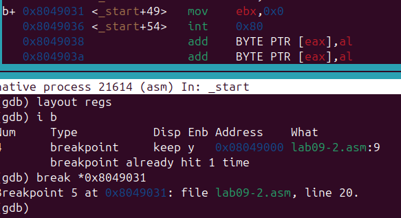{#fig-011 width=90%}

Посмотрим информацию о всех установленных точках останова [рис. @fig-012].

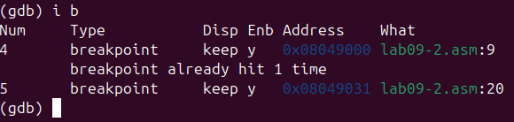{#fig-012 width=90%}

Выполним 5 инструкций с помощью команды stepi (или si) и проследим за изменением значений регистров [рис. @fig-013].

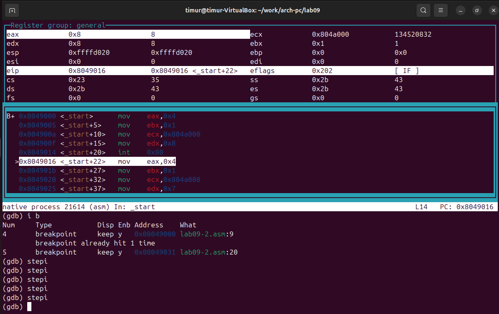{#fig-013 width=90%}

В результате выполнения команд менялись регистры: ebx, ecx, edx,eax, eip.

Посмотрим значение переменной msg1 по имени [рис. @fig-014].

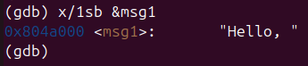{#fig-014 width=90%}

Посмотрим значение переменной msg2 по адресу [рис. @fig-015].

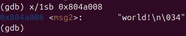{#fig-015 width=90%}

Изменим первый символ переменной msg1 [рис. @fig-016].

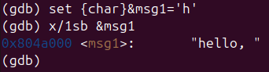{#fig-016 width=90%}

Заменим любой символ во второй переменной msg2 [рис. @fig-017].

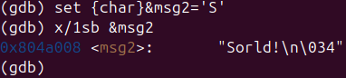{#fig-017 width=90%}

Смотрим значение регистра edx в разных форматах [рис. @fig-018].

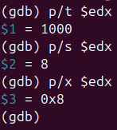{#fig-018 width=90%}

С помощью команды set изменим значение регистра ebx [рис. @fig-019].

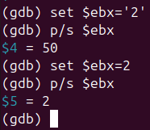{#fig-019 width=90%}

Команда без кавычек интерпретирует вводимое значение как числовую константу, а не как символьную строку.

Завершаем программу и выходим их GDB [рис. @fig-020].

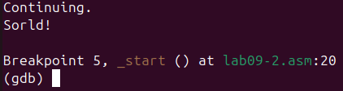{#fig-020 width=90%}

Скопируем файл lab8-2.asm, созданный при выполнении лабораторной работы №8, с программой выводящей на экран аргументы командной строки в файл с именем lab09-3.asm [рис. @fig-021].

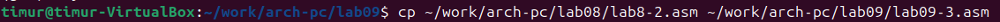{#fig-021 width=90%}

Создаем исполняемый файл и запускаем его в отладчике GDB, указав аргументы [рис. @fig-022].

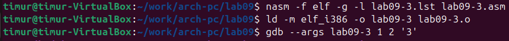{#fig-022 width=90%

Установим точку останова перед первой инструкцией в программе и запустим ее [рис. @fig-023].

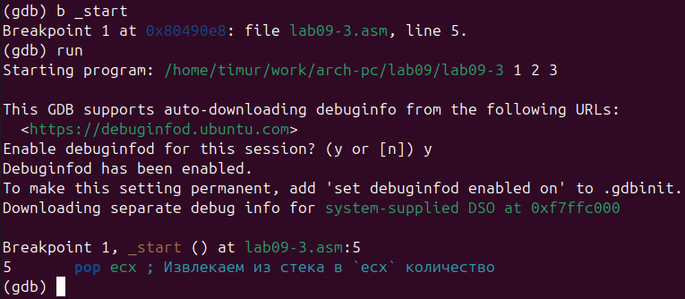{#fig-023 width=90%}

Смотрим позиции стека по разным адресам [рис. @fig-024].

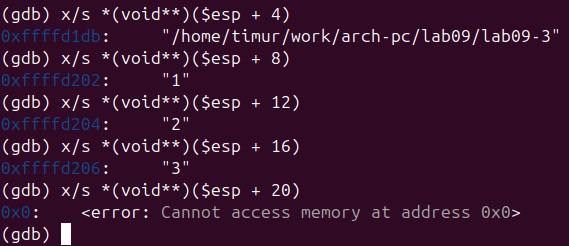{#fig-024 width=90%}

Шаг изменения адреса равен 4, потому что адресные регистры имеют размерность 32 бита(4 байта).

#Задание для самостоятельной работы

1. Преобразуйте программу из лабораторной работы №8 (Задание №1 для самостоятельной работы), реализовав вычисление значения функции f(x) как подпрограмму.

Копируем файл (из 1 задания из заданий для самостоятельной работы) tasklab8.asm в файл с именем lab09-3.asm [рис. @fig-025].

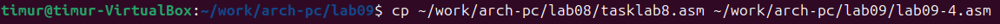{#fig-025 width=90%}

Меняем текст программы, создавя подпрограмму [рис. @fig-026].

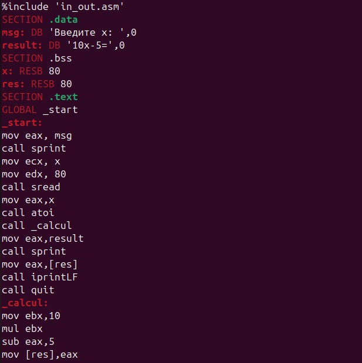{#fig-026 width=90%}

Создаем исполняемый файл и проверяем его [рис. @fig-027].

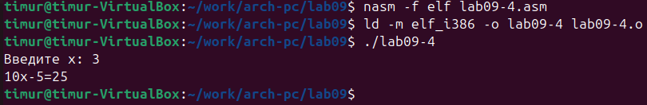{#fig-027 width=90%}

2. В листинге 9.3 приведена программа вычисления выражения (3 + 2) ∗ 4 + 5. При запуске данная программа дает неверный результат. Проверьте это. С помощью отладчика GDB, анализируя изменения значений регистров, определите ошибку и исправьте ее.

Создаем файл для выполнения задания и вводим текст программы из листинга 9.3 [рис. @fig-028].

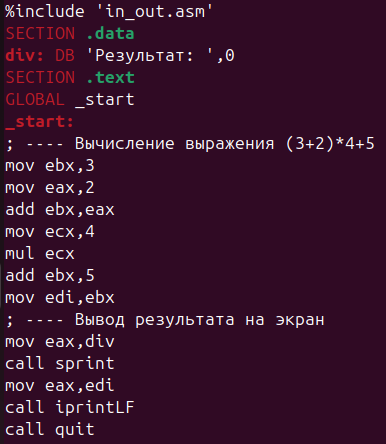{#fig-028 width=90%}

Создаем исполняемый файл и проверяем его [рис. @fig-029].

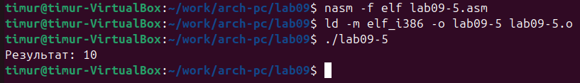{#fig-029 width=90%}

Результат неверный

Создаем исполняемый файл, запускаем его в отладчике GDB и смотрим на изменение регистров командой stepi(si) [рис. @fig-030].

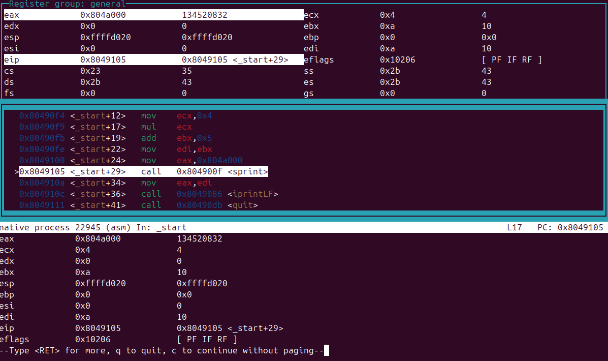{#fig-030 width=90%}

Изменяем текст программы для корректной работы [рис. @fig-031].

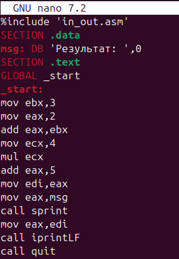{#fig-031 width=90%}

Создаем исполняемый файл и проверяем его [рис. @fig-032].

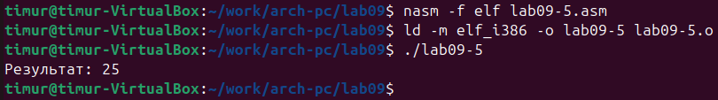{#fig-032 width=90%}

# Вывод

В ходе данной лабораторной работы я приобрел навыки написания программ с использованием подпрограмм. Познакомился с методами отладки при помощи GDB и его основными возможностями.
