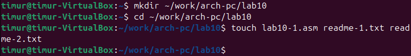
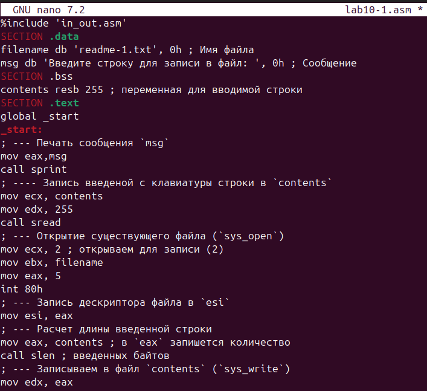
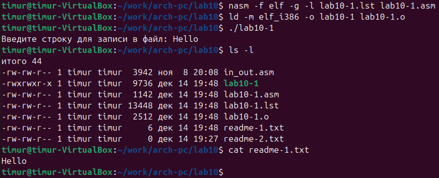
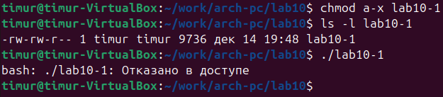
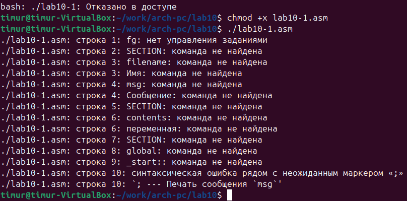
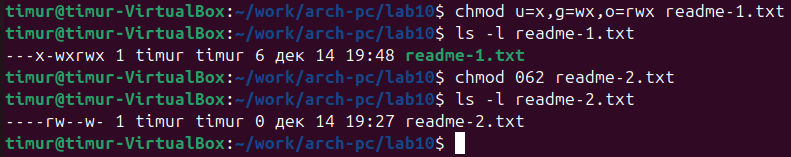
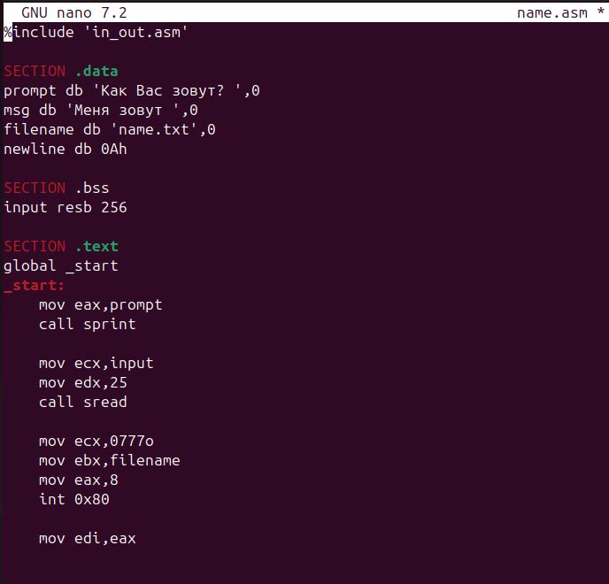
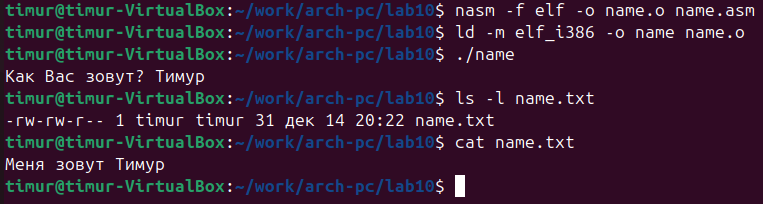

# Цель работы

Приобретение навыков написания программ для работы с файлами.

# Выполнение лабораторной работы

В @tbl-commands приведены основные команды, используемые при работе с git, элементами программирования.

: Основные команды, используемые при работе {#tbl-commands}

| Команды | Описание |
|---------|----------|
| `touch` | Создание файла |
| `nasm` | Компилятор ассемблера NASM |
| `git add` | Добавление изменений в индекс |
| `git commit` | Создание коммита |
| `git push` | Отправка изменений на удаленный репозиторий |
| `ld` | Связывает объектные файлы в исполняемую программу |
| `mkdir` | Создает новую директорию |
| 'chmod' | Команда для изменения прав доступа |

Создадим каталог для программам лабораторной работы № 10, перейдем в него и
создадим файлы lab10-1.asm, readme-1.txt и readme-2.txt [рис. @fig-001].

{#fig-001 width=90%}

Введем в файл lab10-1.asm текст программы из листинга 10.1 [рис. @fig-002]

{#fig-002 width=90%}

Создаем исполняемый файл и проверяем его [рис. @fig-003].

{#fig-003 width=90%}

С помощью команды chmod изменим права доступа к исполняемому файлу lab10-1, запретив его выполнение и попробуем его выполнить [рис. @fig-004].

{#fig-004 width=90%}

В операционной системе Linux для выполнения файла как программы необходимы права на выполнение (x). Когда мы убрали эти права командой chmod a-x, система на уровне ядра блокирует любые попытки выполнить этот файл.

С помощью команды chmod изменим права доступа к файлу lab10-1.asm с исходным текстом программы, добавив права на исполнение и также попробуем его выполнить [рис. @fig-005].

{#fig-005 width=90%}

Файл lab10-1.asm — это текстовый исходный код, а не исполняемая программа; наличие прав на выполнение не делает его автоматически исполняемым

В соответствии с вариантом в таблице 10.4 предоставим права доступа к файлу readme1.txt представленные в символьном виде, а для файла readme-2.txt – в двочном виде. Проверим правильность выполнения с помощью команды ls -l. [рис. @fig-006].

{#fig-006 width=90%}

#Задание для самостоятельной работы

1. Напишите программу работающую по следующему алгоритму:
• Вывод приглашения “Как Вас зовут?”
• ввести с клавиатуры свои фамилию и имя
• создать файл с именем name.txt
• записать в файл сообщение “Меня зовут”
• дописать в файл строку введенную с клавиатуры
• закрыть файл
Создать исполняемый файл и проверить его работу. Проверить наличие файла и его содержимое с помощью команд ls и cat.

Пишем программу работающую по этому алгоритму [рис. @fig-007].

{#fig-007 width=90%}

Создаем исполняемый файл и проверяем его работу. Также проверяем наличие файла и его содержимого с помощью ls и cat [рис. @fig-008].

{#fig-008 width=90%}

# Вывод

В ходе данной лабораторной работы я приобрел навыки написания программ для работы с файлами
